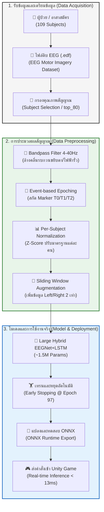

# 🧠 BCI EEG Game: Stroke Rehabilitation System
> **การพัฒนาเกมฟื้นฟูสมรรถภาพทางสมองโดยใช้ Brain–Computer Interface (BCI) สำหรับผู้ป่วยโรคหลอดเลือดสมอง**

ระบบจำแนกสัญญาณคลื่นสมอง (EEG) เพื่อจำแนกจินตนาการการเคลื่อนไหว (Motor Imagery: Left Hand, Right Hand, Rest State) ด้วยแบบจำลองระดับสูง **Large Hybrid EEGNet + LSTM (CNN-RNN)** และประมวลผลประสิทธิภาพสูงผ่านฟอร์แมต **ONNX Runtime** เพื่อนำไปพัฒนาต่อร่วมกับ Unity Game Engine

---

## 📌 ภาพรวมโครงงาน (Project Overview)
การจำแนกสัญญาณคลื่นสมอง (EEG) เป็นหนึ่งในโจทย์ที่ท้าทายที่สุดเนื่องจากสัญญาณมี Noise สูงและมีความผันผวนระหว่างบุคคล (Inter-subject Variability) โครงงานนี้ใช้สถาปัตยกรรมโมเดลผสมผสานเพื่อสกัดลักษณะเด่นทางเวลาและพื้นที่ (Spatial-Temporal Features) โดยดึงจุดเด่นของ **EEGNet** (สกัดข้อมูลในขั้วสมองต่าง ๆ) และ **LSTM** (เรียนรู้ความสัมพันธ์ของจังหวะเวลา) ส่งผลให้สามารถจำแนกจินตนาการการสั่งการได้แม่นยำและรวดเร็วในระดับเรียลไทม์

### 🚀 ไฮไลท์ทางเทคนิค (Key Highlights)
*   **Universal Model:** ฝึกฝนบนอาสาสมัครที่สัญญาณดีที่สุด 50 คน (จากทั้งหมด 109 คน) เพื่อสร้างโมเดลกลางที่มี Generalization สูง
*   **High Performance:** ทำความแม่นยำ (Validation Accuracy) ได้ถึง **77.12%** และ F1-Score **0.77** อย่างสมดุลในทุกคลาส
*   **Ultra-Low Latency:** แปลงโมเดลเป็น **ONNX** เพื่อทำความเร็วการทำนายใน Unity เกมเฉลี่ยเพียง **12.41 ms** ต่อแพ็กเก็ตสัญญาณ (เร็วกว่าเกณฑ์ตรวจจับของมนุษย์)
*   **Data-Centric AI:** ใช้เทคนิคกรองสัญญาณ Band-pass Filter (4-40Hz), Per-Subject Normalization (Z-Score) และ Event-Based Epoching (สกัดเฉพาะช่วงทำกิจกรรมจริง)

---

## 🗺️ แผนภูมิขั้นตอนการทำงาน (BCI Pipeline Flow)

การประมวลผลถูกออกแบบเป็น Pipeline ตั้งแต่ต้นน้ำถึงปลายน้ำ ดังแผนภาพนี้:



---

## 📊 โครงสร้างโฟลเดอร์ของโปรเจกต์ (Directory Structure)
เพื่อให้สอดคล้องกับมาตรฐาน Git ไฟล์ขนาดใหญ่ (เช่น ข้อมูลดิบ EDF และไฟล์ NumPy หนัก ๆ) จะถูกละเว้น (Ignored) ออกจาก Repository เพื่อไม่ให้ขนาดบวม โดยโครงสร้างมีดังนี้:

```text
├── images/                        # รูปภาพประกอบและกราฟผลลัพธ์ของโมเดล
│   ├── bci_research_flowchart.png
│   ├── eeg_preprocessing_pipeline.png
│   └── hardware_usage_dashboard.png
├── top_50_subjects.json           # รายชื่อ Subject 50 คนที่ผ่านการคัดเลือก
├── top_80_subjects.json           # รายชื่อ Subject 80 คนที่มีคลื่นสมองดีที่สุด
├── requirements.txt               # รายการไลบรารีและ Dependencies ทั้งหมด
├── .gitignore                     # ไฟล์ตั้งค่าสำหรับละเว้นโฟลเดอร์ S001-S109 และไฟล์โมเดล
├── Train_Hybrid_EEGNet_LSTM.py    # สคริปต์หลักในการ Preprocessing และเทรนโมเดล
├── check_model.py                 # ตรวจสอบขนาดพารามิเตอร์ของโมเดล H5
├── convert_and_test_onnx.py       # แปลงโมเดล Keras H5 เป็นฟอร์แมต ONNX
├── evaluate_onnx.py               # ทดสอบโมเดล ONNX บนข้อมูลชุด Test เพื่อดึง Classification Report
├── inference.py                   # จำลองการดึงสัญญาณคลื่นสมองเรียลไทม์มาพยากรณ์ผล
├── visualize_inference.py         # วาดกราฟเปรียบเทียบสัญญาณดิบ ผลทำนาย และความมั่นใจ (Confidence)
├── action_log.md                  # ประวัติบันทึกขั้นตอนการทดลองและประมวลผลอย่างละเอียด
└── README.md                      # ไฟล์แนะนำโครงการนี้
```

---

## 🛠️ ขั้นตอนการติดตั้งสภาพแวดล้อม (Environment Setup)

1. **สร้างสภาพแวดล้อม Python ด้วย Conda:**
   แนะนำให้ใช้ Python 3.10 เพื่อหลีกเลี่ยงปัญหาความเข้ากันได้ของ TensorFlow และ ONNX
   ```bash
   conda create -n bci-project python=3.10 -y
   conda activate bci-project
   ```

2. **ติดตั้งไลบรารีที่จำเป็น:**
   ```bash
   pip install -r requirements.txt
   ```

---

## 📥 วิธีการจัดหาชุดข้อมูล (Dataset Procurement)
เนื่องจากชุดข้อมูลดิบ **EEG Motor Movement/Imagery Dataset** (ไฟล์ `.edf` สำหรับอาสาสมัคร 109 คน) มีขนาดประมาณ **3.27 GB** จึงไม่ถูกอัปโหลดขึ้น Git

*   **ดาวน์โหลดอัตโนมัติ:** เมื่อคุณรัน `Train_Hybrid_EEGNet_LSTM.py` ตัวโค้ดจะใช้ไลบรารี `mne.datasets.eegbci.load_data` เพื่อดึงข้อมูลเฉพาะ Subject ที่ระบุมาไว้ในระบบแบบอัตโนมัติ
*   **ดาวน์โหลดโดยตรง:** สามารถเข้าไปศึกษาเพิ่มเติมหรือโหลดไฟล์ดิบทั้งหมดได้ที่หน้าเว็บหลักของ [PhysioNet EEG Motor Movement/Imagery Dataset](https://physionet.org/content/eegmmidb/1.0.0/)

---

## 🏃 วิธีการรันโปรเจกต์ (Pipeline Execution)

### 1. การฝึกสอนโมเดล (Training)
ทำการประมวลผลข้อมูล (Filter, Epoching, Normalize) และเทรนโมเดลผสมผสาน CNN-LSTM:
```bash
python Train_Hybrid_EEGNet_LSTM.py
```
*ระบบจะบันทึกกราฟการเทรนและไฟล์โมเดล `bci_hybrid_model.h5`*

### 2. การตรวจสอบขนาดโมเดล
```bash
python check_model.py
```

### 3. การแปลงโมเดลเป็น ONNX
แปลงไฟล์ `.h5` เป็น `.onnx` เพื่อนำไปใช้งานกับ Unity:
```bash
python convert_and_test_onnx.py
```
*ระบบจะสร้างไฟล์ `bci_hybrid_model.onnx`*

### 4. การประเมินประสิทธิภาพโมเดล (Evaluation)
ประเมินผลบนข้อมูลทดสอบ (1,000 ตัวอย่าง) เพื่อดูค่าชี้วัดรายคลาส:
```bash
python evaluate_onnx.py
```

### 5. การทดสอบทำนายผลแบบเรียลไทม์ (Simulation Inference)
ทดสอบการทำงานของโมเดลด้วยความหน่วงและประสิทธิภาพจริง:
```bash
python inference.py
```

### 6. การวาดกราฟวิเคราะห์ Inference
วิเคราะห์ความสัมพันธ์ของรูปแบบสัญญาณคลื่นสมอง และความมั่นใจของคำสั่งพยากรณ์:
```bash
python visualize_inference.py
```

---

## 📈 ผลการทดสอบโมเดล (Model Performance Results)

### **ตารางสรุปผลประสิทธิภาพ (Performance Summary)**
| ดัชนีชี้วัด (Metrics) | ผลลัพธ์จากการทดสอบ (Actual Value) |
| :--- | :---: |
| **ความแม่นยำชุดทดสอบ (Test Accuracy)** | **79.00%** |
| **ความแม่นยำชุดเทรน (Training Accuracy)** | 80.24% |
| **ความแม่นยำชุดตรวจสอบ (Validation Accuracy)** | 77.12% |
| **ความหน่วงต่อตัวอย่าง (Latency per Sample)** | **~12.41 ms** (บน CPU) |
| **สัดส่วน F1-Score เฉลี่ย (F1-Score Avg)** | **0.79** |

### **รายงานผลจำแนกรายคลาส (Classification Report)**
```text
              precision    recall  f1-score   support

    Left Hand       0.78      0.80      0.79       338
   Right Hand       0.77      0.77      0.77       329
 Resting Mode       0.82      0.80      0.81       333

     accuracy                           0.79      1000
```
*วิเคราะห์ผล:* โมเดลจำแนกทั้ง 3 คลาสได้อย่างสมดุล (F1-score ~0.77-0.81) และคลาส `Resting Mode` (สภาวะพัก) มีความแม่นยำสูงสุด ซึ่งช่วยลดปัญหาคำสั่งผี (Ghost Inputs) ในระหว่างผู้ป่วยพักผ่อนในเกมได้อย่างยอดเยี่ยม

---

## 🧠 ข้อมูลโครงงาน
*   **หัวข้อ:** การพัฒนาเกมฟื้นฟูสมรรถภาพทางสมองโดยใช้ Brain–Computer Interface (BCI) สำหรับผู้ป่วยโรคหลอดเลือดสมอง

